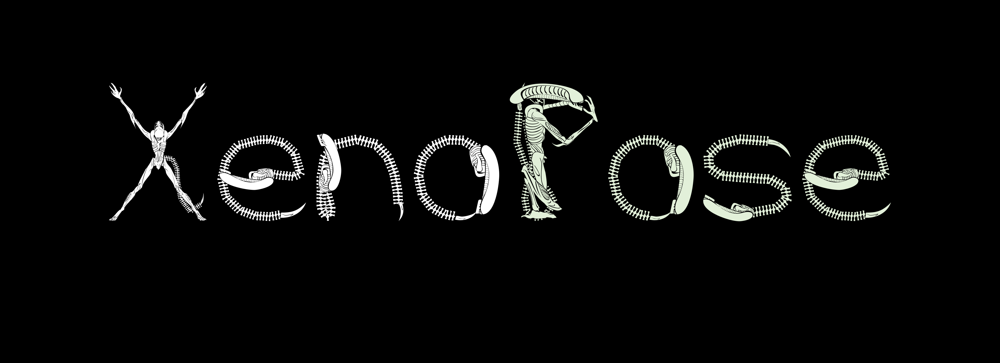
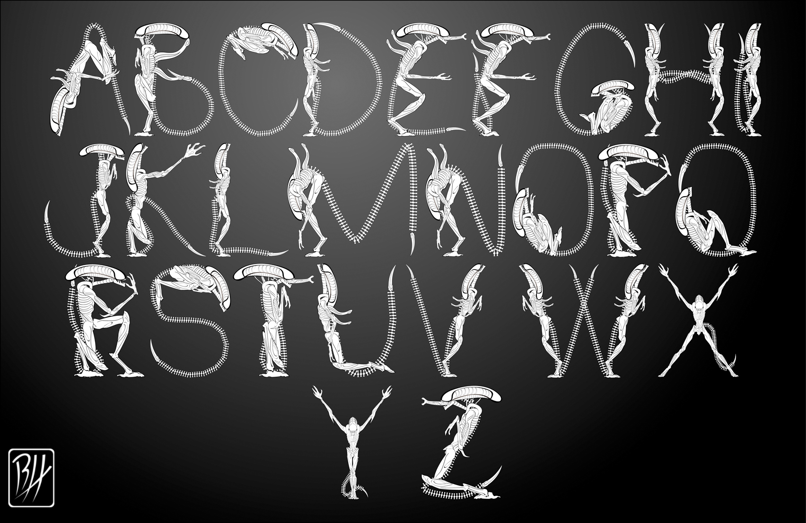
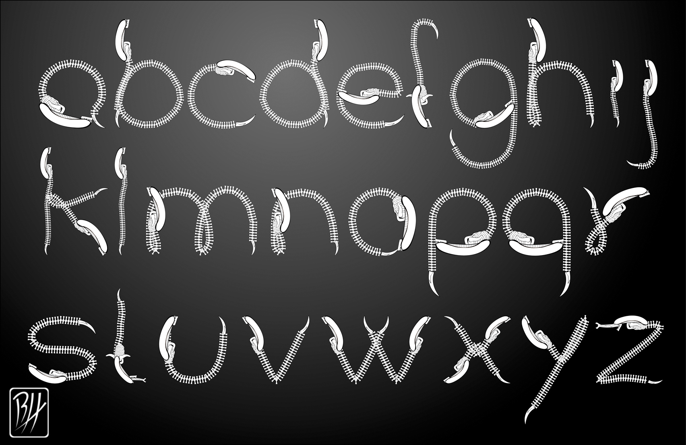

<picture>
  <source media="(prefers-color-scheme: dark)" srcset="documentation/banner_dark.png">
  <source media="(prefers-color-scheme: light)" srcset="documentation/banner_light.png">
  
</picture>

# XenoPose

A font based on xenomorph specie from Aliens franchise.

## Base design

The design is mainly based on the drawings made by [@Predaguy](https://linktr.ee/Predaguy). The original designer had prepared the homework for his typography class, and then released it online on DeviantArt which are linked and attached below: [uppercase](http://predaguy.deviantart.com/art/Xenomorph-Font-UPPER-CASE-144698748) (dead link, [backup here](https://web.archive.org/web/20150912030939/http://predaguy.deviantart.com/art/Xenomorph-Font-UPPER-CASE-144698748)) and [lowercase](http://predaguy.deviantart.com/art/Xenomorph-Font-lower-case-144697784) (dead link, [backup here](https://web.archive.org/web/20150912023622/http://predaguy.deviantart.com/art/Xenomorph-Font-lower-case-144697784)).

*Images copyright © 2009 @Predaguy*

## Conversion to digital font

[@NightFurySL2001](https://github.com/NightFurySL2001) had reached out to @Predaguy for the digital source files, which luckily had a backup of the vector illustrations, and kindly provided permission for @NightFurySL2001 to convert it to a digital font. The vector diagrams are subsequently modified and adjusted for production usage. She has kindly assembled the font and release it under a open source license for all to use. 

A total of 90 glyphs has been made, with the 52 Latin alphabets from @Predaguy, and the remaining 38 numerals and punctuations from @NightFurySL2001. The final font file contains 92 glyphs. Some punctuations are missing due to lack of design inspiration. 

Fonts are available for download in [`fonts`](./fonts/) folder.

## Building from sources

The build chain runs on Python 3. Requires [`gftools builder`](https://github.com/googlefonts/gftools) to build the font and [`brotli`](https://github.com/google/brotli) for webfont WOFF2 compression. 

To build the font, run `gftools builder ./sources/config.yaml`.

## Licensing

XenoPose is licensed under the SIL Open Font License, Version 1.1.  
The license is available with a FAQ at https://openfontlicense.org and attached in this repository under the [OFL.md](./OFL.md) file.